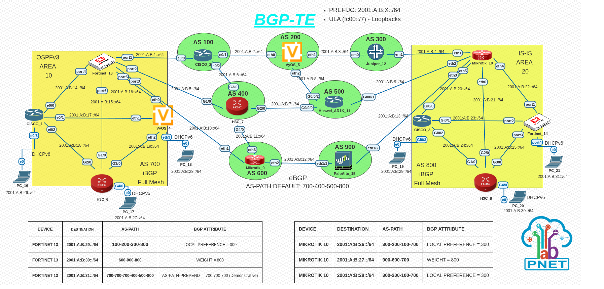
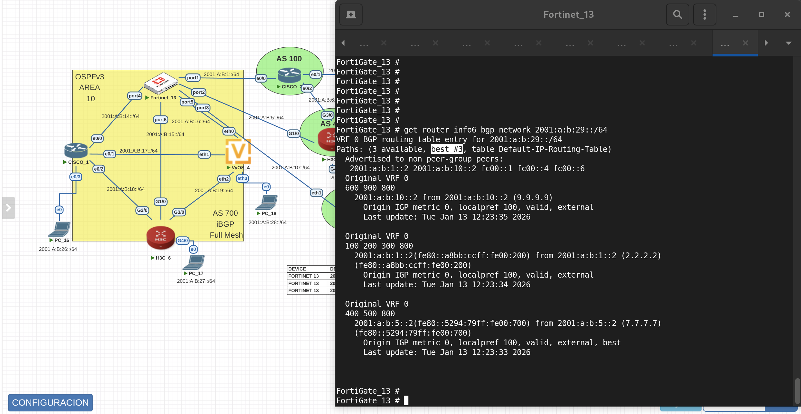
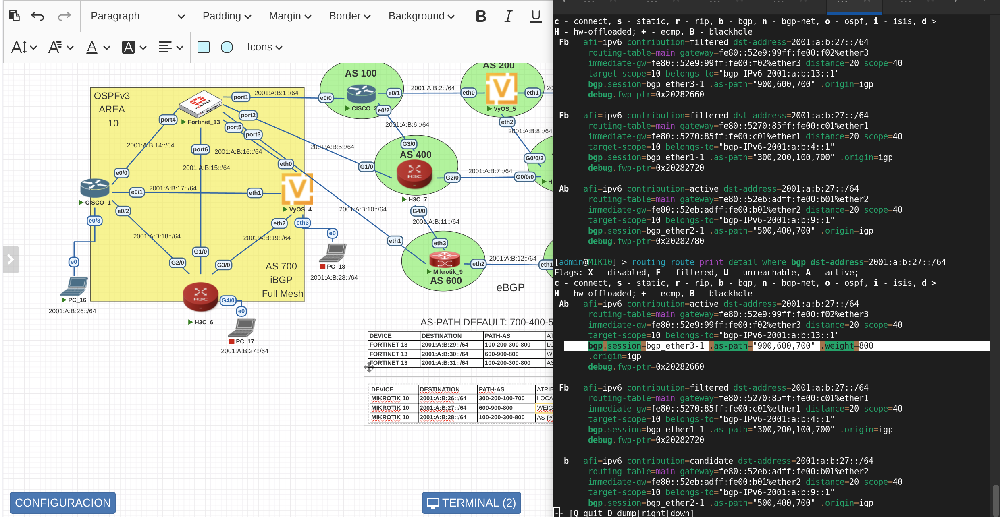

# BGP_TE
## Topología del laboratorio

## Tabla de enrutamiento BGP(Atributos BGP no configurados)

## Rutas al prefijo 2001:A:B:29::/64

## Tabla de enrutamiento BGP(Atributos BGP configurados)

## Modificacion Atributos MikroTik(Local-Preference)

## Modificacion Atributos MikroTik(Weight)

# Modificacion Atributos 2 MikroTik(Local-Preference)

## PRUEBA DE CONECTIVIDAD 

