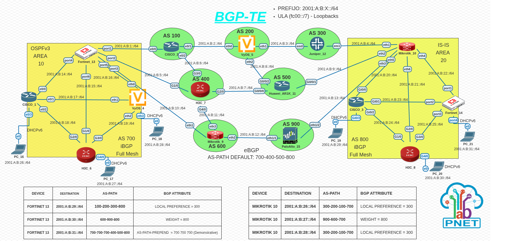
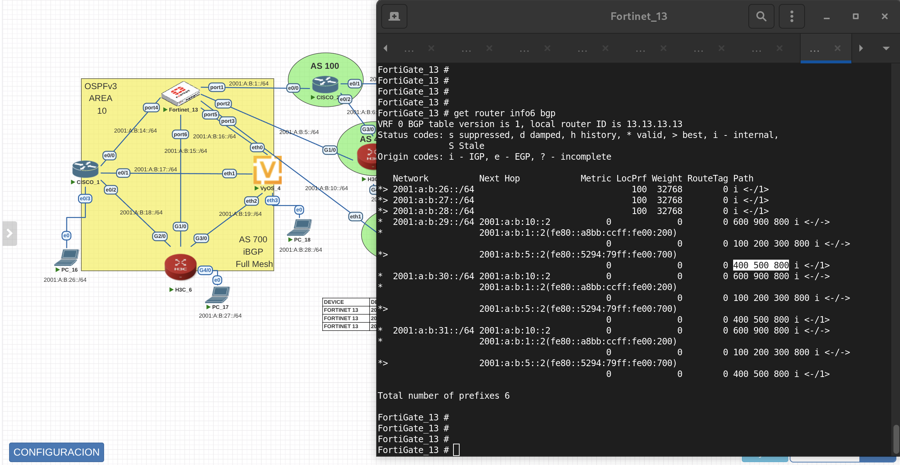
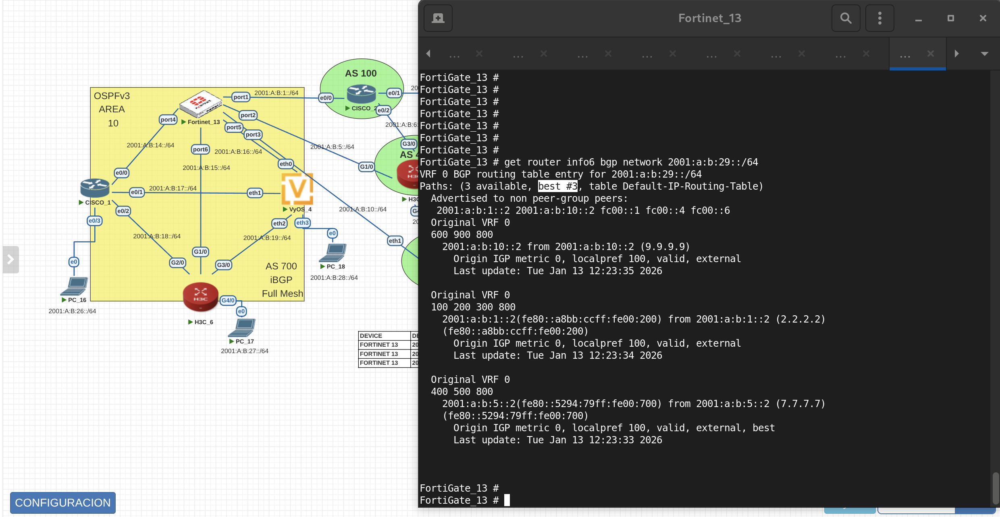
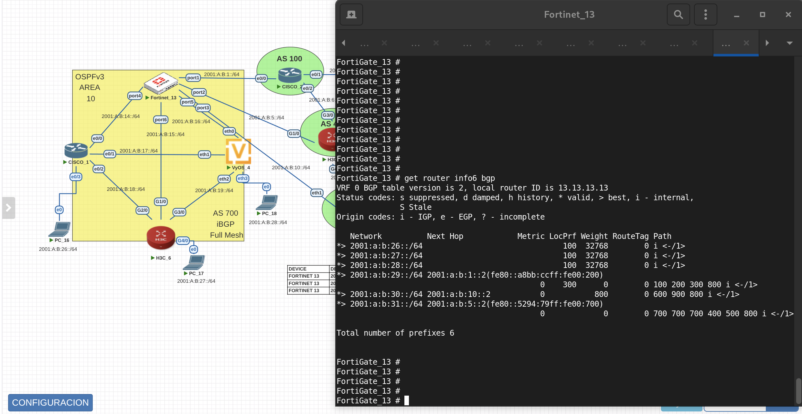
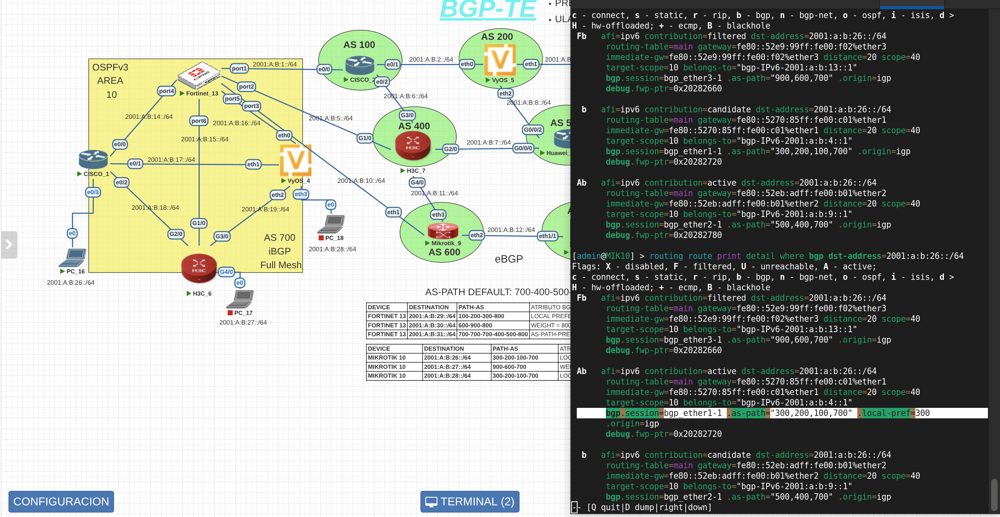
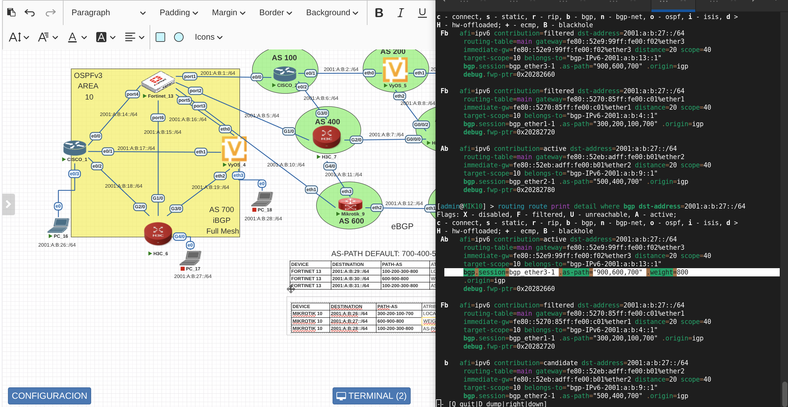
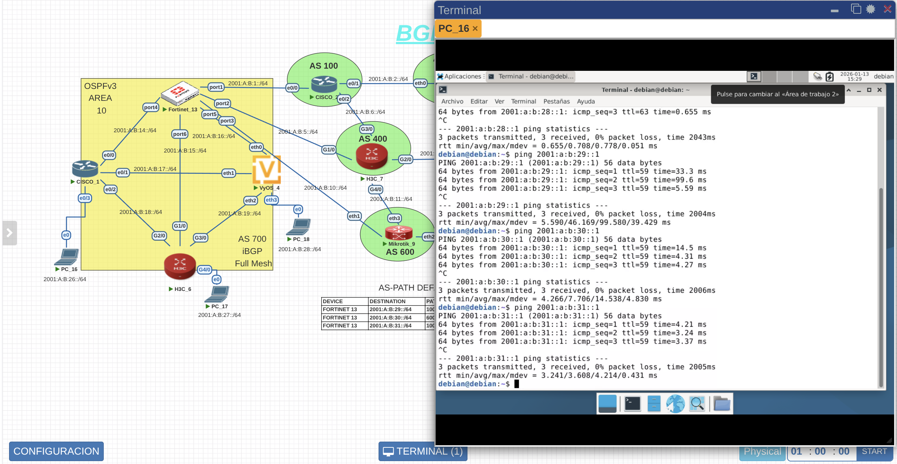

# BGP_TE

Comparto un nuevo escenario de laboratorio centrado en el control de tráfico y la toma de decisiones en BGP, integrando múltiples protocolos IGP y un entorno multi-AS, multivendedor y completamente IPv6.

El objetivo principal era analizar y manipular la selección de rutas en BGP utilizando diferentes atributos, manteniendo la interoperabilidad con los protocolos IGP internos.

## Topología del laboratorio

🏗 Tecnologías implementadas

🌐 IPv6

🔁 IS-IS Nivel 1

🔁 OSPFv3

📡 BGP (eBGP + iBGP Full Mesh)

🧠 Ingeniería de tráfico BGP (Ponderación, Preferencia local, Precedencia de ruta AS)

🖧 DHCPv6 con estado

🔐 Políticas de firewall

🧩 Entorno multivendedor (Cisco, Juniper, Huawei, MikroTik, Fortinet, Palo Alto, VyOS, H3C)

## Tabla de enrutamiento BGP(Atributos BGP no configurados)

## Rutas al prefijo 2001:A:B:29::/64

## Tabla de enrutamiento BGP(Atributos BGP configurados)

## Modificacion Atributos MikroTik(Local-Preference)

## Modificacion Atributos MikroTik(Weight)

# Modificacion Atributos 2 MikroTik(Local-Preference)

## PRUEBA DE CONECTIVIDAD 

